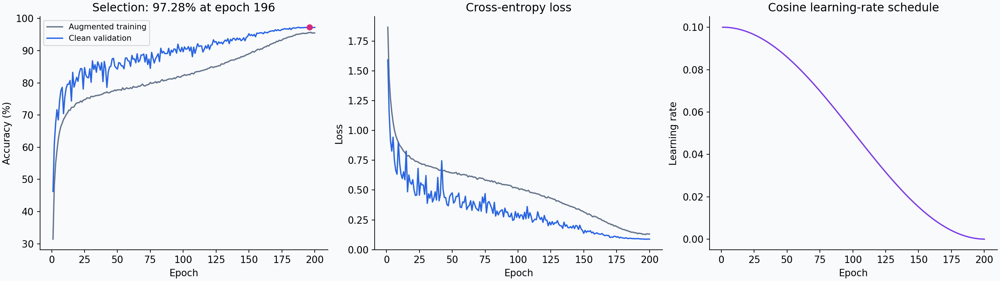
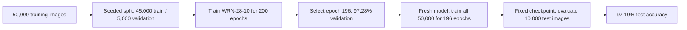
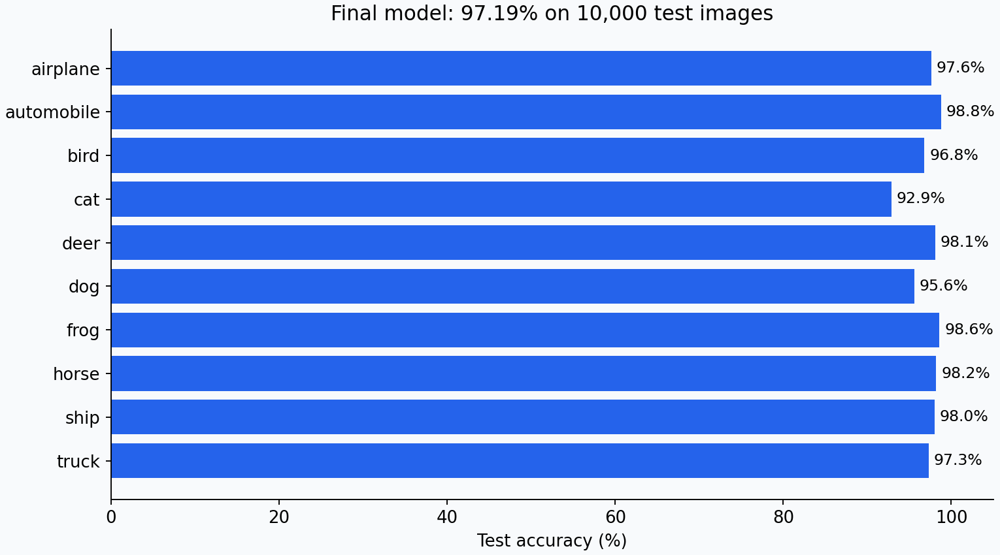
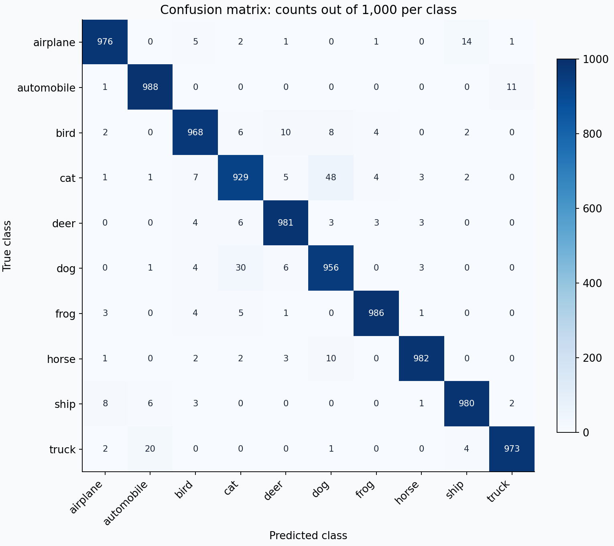

# CIFAR-10 classification with Wide ResNet

**97.19% test accuracy · WRN-28-10 · trained from scratch**

This project classifies 32 × 32 RGB images into ten classes. The fixed final model correctly classified **9,719 of 10,000** CIFAR-10 test images. Training uses Python and PyTorch; the figures below are generated directly from saved experimental records.



## How the result was obtained



The validation run chooses the duration, then full-data training starts from fresh weights, BatchNorm buffers and optimizer state. It recomputes normalization over all 50,000 training images and retains the 200-epoch cosine schedule. Validation weights are not transferred. The test result does not select the model or training duration. An earlier plain CNN had already been evaluated at 90.83%; this WRN received a separate evaluation after its checkpoint was fixed.

| Component | Recorded setting |
|---|---|
| Architecture | WRN-28-10, 36,479,194 parameters |
| Residual groups | Four preactivation blocks per group; 160 / 320 / 640 channels |
| Regularization | Dropout 0.3; weight decay 0.0005 |
| Optimization | SGD, initial learning rate 0.1, Nesterov momentum 0.9 |
| Schedule | Epoch cosine decay, T_max 200, minimum learning rate 0 |
| Training augmentation | Reflect padding 4 and random crop, horizontal flip 0.5, CIFAR-10 AutoAugment, Cutout length 16 |
| Batch / seed | 128 / 42; no dropped samples |
| Precision | Float32; no mixed precision or TF32 |
| Hardware | NVIDIA RTX 4500 Ada Generation |
| Recorded framework | PyTorch 2.13.0+cu126; evaluation torchvision 0.28.0+cu126 |

Convolutions extract visual features; residual shortcuts help gradients pass through the network. Augmentation exposes the model to varied training images, while dropout and weight decay constrain overfitting. Momentum smooths SGD updates, and cosine decay reduces the learning rate late in training. These are descriptions of the recipe: no ablation study was performed to assign the improvement to any single component.

Training accuracy is measured on augmented images with dropout active. Validation uses clean images in evaluation mode, so a higher validation curve is expected to be possible. Normalization uses only the 45,000 training images during selection. Evaluation uses the final checkpoint's full-training statistics, one unaugmented forward pass, `model.eval()` and `torch.no_grad()`; there is no test-time augmentation.

## Visual evidence





Each class has 1,000 test images. Cats are the hardest class (92.9%); automobiles are the strongest (98.8%). Cat–dog confusion accounts for a visible portion of the errors.

## Run the demonstration

Use Python 3.12 and a compatible PyTorch/torchvision installation. `requirements.txt` names the dependencies; it is not an exact environment lock. Use a fresh virtual environment appropriate to your CPU or GPU.

```bash
python -m pip install -r requirements.txt
python scripts/visualize.py
python demo.py --help
python demo.py path/to/your-image.png
```

The first script verifies the saved counts and selected epoch, then regenerates the three figures without accessing CIFAR-10 or training a model. The prediction command loads `models/final_model.pt` and prints the top three classes. The checkpoint is present in this local repository but excluded from Git; see [checkpoint distribution](models/README.md). A clone needs that file supplied separately. The demo resizes custom images to 32 × 32; large real-world photographs may differ substantially from CIFAR-10. Softmax scores are not calibrated confidence estimates.

## Explore the implementation

- [Model architecture](deadline_wrn/model.py): residual blocks, initialization and classifier.
- [Training workflow](deadline_wrn/workflow.py): data transformations, optimization, checkpointing and selection.
- [Training entry point](deadline_wrn/run.py): configuration and explicit execution gates.
- [Image prediction demo](demo.py): preprocessing and top-three output.
- [Saved results](results/): histories, configurations, selection plan and original evaluation report.
- [Training and reproduction guide](docs/METHOD.md): how to run the preserved training code.

## Interpretation and provenance

This is a measured result from one experimental workflow, not a guarantee that every new run will achieve 97.19%. The original implementation combines a Torch-style Wide ResNet with torchvision AutoAugment, Cutout and an epoch cosine schedule; it is not an exact reproduction of a published recipe. The expanded WRN method departs from the earlier course restrictions on residual connections, initialization, momentum, schedules and augmentation.

Original references recorded with the experiment: [Wide Residual Networks](https://arxiv.org/abs/1605.07146), [original WRN implementation](https://github.com/szagoruyko/wide-residual-networks/blob/master/models/wide-resnet.lua), [AutoAugment](https://arxiv.org/abs/1805.09501), and [Cutout](https://arxiv.org/abs/1708.04552). These references explain the methods; the saved local evaluation supports this project's accuracy claim.
